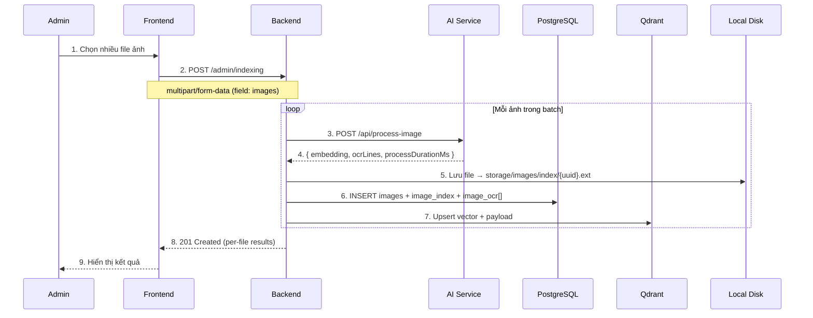
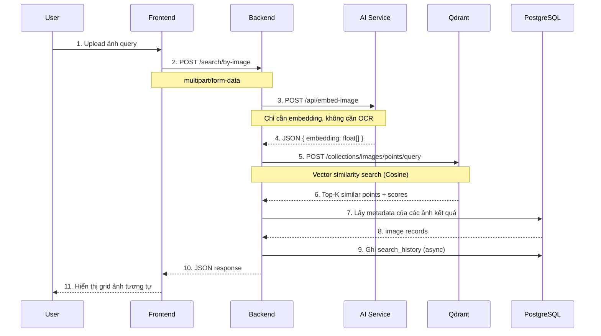
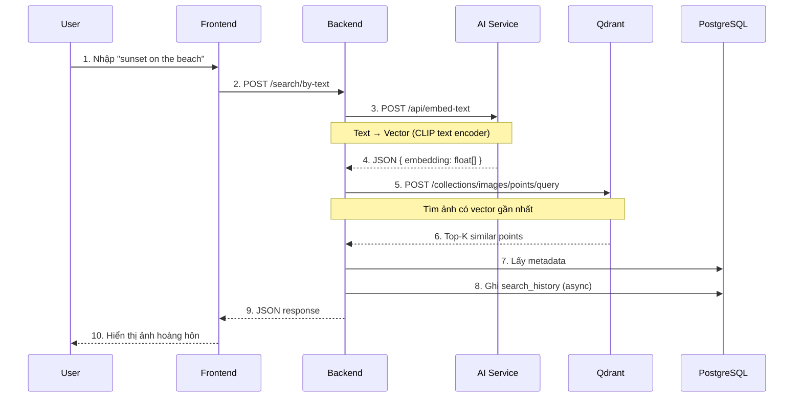
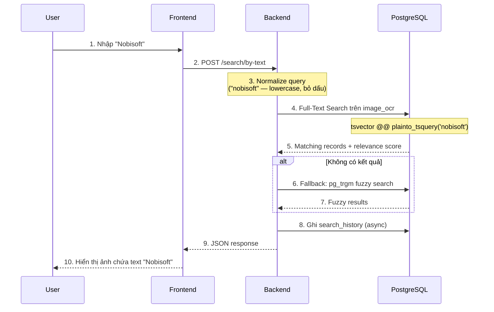
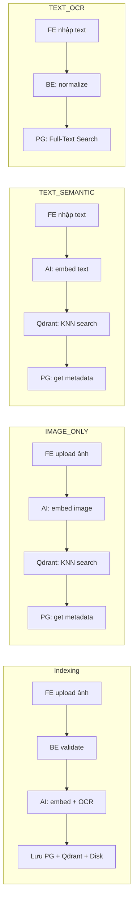

# 📘 Visual Search Engine — API & Flow Documentation

> Tài liệu mô tả chi tiết các API endpoint và luồng use case chính, bao gồm API contract (JSON) giữa Frontend ↔ Backend ↔ AI Service ↔ Qdrant.

---

## Tổng quan kiến trúc

```
┌──────────┐     HTTP/REST     ┌──────────┐     HTTP/REST     ┌────────────┐
│ Frontend │ ◄──────────────► │ Backend  │ ◄──────────────► │ AI Service │
│ (React)  │                   │ (Node.js)│                   │ (FastAPI)  │
└──────────┘                   └────┬─────┘                   └────────────┘
                                    │
                        ┌───────────┼───────────┐
                        ▼           ▼           ▼
                   ┌─────────┐ ┌────────┐ ┌──────────┐
                   │PostgreSQL│ │ Qdrant │ │Local Disk│
                   │(metadata,│ │(vectors)│ │ (images) │
                   │OCR, etc) │ └────────┘ └──────────┘
                   └─────────┘
```

### Service URLs (Docker)

| Service | Internal URL | External URL |
|---------|-------------|--------------|
| Backend | `http://backend:8000` | `http://localhost:8000` |
| AI Service | `http://ai-service:9000` | `http://localhost:9000` |
| Qdrant | `http://qdrant:6333` | `http://localhost:6333` |
| PostgreSQL | `database:5432` | `localhost:5432` |

---

## 📋 Tổng hợp API Endpoints

### Admin APIs (yêu cầu Admin JWT)

| Method | Endpoint | Mô tả |
|--------|----------|-------|
| `POST` | `/admin/indexing` | Upload & index batch ảnh (tối đa 20 file) |
| `GET` | `/admin/images` | Danh sách ảnh đã index (phân trang, filter) |
| `GET` | `/admin/images/:id` | Chi tiết 1 ảnh (full OCR data) |
| `DELETE` | `/admin/images/:id` | Xoá ảnh (cascade: PG + Qdrant + file) |
| `GET` | `/admin/users` | Danh sách người dùng |
| `GET` | `/admin/users/:userId/search-history` | Lịch sử tìm kiếm của user |

### Auth APIs

| Method | Endpoint | Mô tả |
|--------|----------|-------|
| `POST` | `/auth/register` | Đăng ký tài khoản |
| `POST` | `/auth/login` | Đăng nhập, nhận JWT |

### Search APIs (sẽ triển khai)

| Method | Endpoint | Mô tả |
|--------|----------|-------|
| `POST` | `/search/by-image` | Tìm ảnh tương tự bằng ảnh (IMAGE_ONLY) |
| `POST` | `/search/by-text` | Tìm ảnh bằng text (TEXT_SEMANTIC / TEXT_OCR) |

### Internal APIs (Backend → AI Service)

| Method | Endpoint | Khi nào dùng | Output |
|--------|----------|-------------|--------|
| `POST` | `/api/process-image` | Indexing | embedding + OCR + processDurationMs |
| `POST` | `/api/embed-image` | Search by Image | embedding only |
| `POST` | `/api/embed-text` | Search by Text Semantic | embedding only |

---

## Use Case 1: Admin Batch Indexing

### Sequence Diagram



### API: Frontend → Backend

```
POST /admin/indexing
Authorization: Bearer <admin_jwt_token>
Content-Type: multipart/form-data
```

**Request (form-data):**

| Field | Type | Required | Description |
|-------|------|----------|-------------|
| images | File[] | ✅ | Danh sách ảnh (tối đa 20 file, mỗi file max 10MB, chấp nhận jpg/png/webp) |

**Response — 201 Created:**

```json
{
  "success": true,
  "message": "Indexing hoàn tất: 3 thành công, 1 thất bại",
  "data": [
    {
      "filename": "photo1.jpg",
      "success": true,
      "imageId": "550e8400-e29b-41d4-a716-446655440000"
    },
    {
      "filename": "photo2.png",
      "success": true,
      "imageId": "660f9500-f30c-52e5-b827-557766550000"
    },
    {
      "filename": "corrupted.jpg",
      "success": false,
      "error": "AI process-image failed: 422 Unprocessable Entity"
    }
  ]
}
```

**Response — 400 Bad Request:**

```json
{
  "success": false,
  "message": "Vui lòng chọn ít nhất 1 ảnh"
}
```

### API: Backend → AI Service

```
POST http://ai-service:9000/api/process-image
Content-Type: multipart/form-data
```

**Request (form-data):**

| Field | Type | Required | Description |
|-------|------|----------|-------------|
| image | File | ✅ | Binary ảnh |

**Response — 200 OK:**

```json
{
  "success": true,
  "data": {
    "embedding": [0.0123, -0.0456, 0.0789, "... (512 floats)"],
    "ocrLines": [
      {
        "rawText": "NOBISOFT TECHNOLOGY CO., LTD",
        "confidenceScore": 0.98,
        "boundingBox": { "x": 100, "y": 50, "width": 520, "height": 30 }
      },
      {
        "rawText": "123 Nguyen Hue, District 1, HCMC",
        "confidenceScore": 0.93,
        "boundingBox": { "x": 100, "y": 90, "width": 480, "height": 28 }
      }
    ],
    "processDurationMs": 1250
  }
}
```

> [!NOTE]
>
> - `embedding`: Mảng float từ model CLIP — kích thước cố định (512).
> - `ocrLines`: Mỗi phần tử = **1 dòng text** trên ảnh. Nếu ảnh không có text → `[]`.
> - `processDurationMs`: Thời gian AI xử lý (ms), lưu vào DB để tracking performance.

### Dữ liệu lưu trữ

| Nơi lưu | Bảng/Collection | Dữ liệu |
|---------|----------------|---------|
| **PostgreSQL** | `images` | id, path, width, height, fileSize, fileFormat |
| **PostgreSQL** | `image_index` | imageId, processDurationMs, indexedAt |
| **PostgreSQL** | `image_ocr` | rawText, normalizedText, confidence, boundingBoxes |
| **Qdrant** | `images` | vector + payload (imageId, path, fileFormat, hasOcr) |
| **Local Disk** | `storage/images/index/` | File ảnh gốc |

---

## Admin Image Management

### GET /admin/images — Danh sách ảnh đã index

```
GET /admin/images?page=1&limit=20&fileFormat=jpg&fromDate=2026-01-01&toDate=2026-12-31
Authorization: Bearer <admin_jwt_token>
```

**Query Parameters:**

| Param | Type | Default | Description |
|-------|------|---------|-------------|
| page | integer | 1 | Số trang |
| limit | integer | 20 | Số kết quả/trang (max 100) |
| fileFormat | string | — | Lọc theo format: jpg, png, webp |
| fromDate | date | — | Lọc từ ngày |
| toDate | date | — | Lọc đến ngày |

**Response — 200 OK:**

```json
{
  "success": true,
  "message": "Lấy danh sách ảnh thành công",
  "data": [
    {
      "id": "550e8400-e29b-41d4-a716-446655440000",
      "path": "storage/images/index/550e8400.jpg",
      "width": 1920,
      "height": 1080,
      "fileSize": 245760,
      "fileFormat": "jpg",
      "createdAt": "2026-07-10T08:30:00.000Z",
      "imageIndex": {
        "id": "770g0600-g50e-62f6-c928-668877660000",
        "processDurationMs": 1250,
        "indexedAt": "2026-07-10T08:30:01.000Z",
        "ocrLines": [
          { "rawText": "NOBISOFT TECHNOLOGY", "confidenceScore": 0.98 },
          { "rawText": "123 Nguyen Hue", "confidenceScore": 0.93 }
        ]
      }
    }
  ],
  "meta": {
    "page": 1,
    "limit": 20,
    "totalDocs": 150,
    "totalPages": 8
  }
}
```

> [!NOTE]
> `ocrLines` trong list chỉ preview tối đa 3 dòng. Dùng GET /:id để xem đầy đủ.

### GET /admin/images/:id — Chi tiết ảnh

```
GET /admin/images/550e8400-e29b-41d4-a716-446655440000
Authorization: Bearer <admin_jwt_token>
```

**Response — 200 OK:**

```json
{
  "success": true,
  "message": "Lấy chi tiết ảnh thành công",
  "data": {
    "id": "550e8400-e29b-41d4-a716-446655440000",
    "path": "storage/images/index/550e8400.jpg",
    "width": 1920,
    "height": 1080,
    "fileSize": 245760,
    "fileFormat": "jpg",
    "createdAt": "2026-07-10T08:30:00.000Z",
    "imageIndex": {
      "id": "770g0600-g50e-62f6-c928-668877660000",
      "processDurationMs": 1250,
      "indexedAt": "2026-07-10T08:30:01.000Z",
      "ocrLines": [
        {
          "id": "880h0700-h61f-73g7-d039-779988770000",
          "rawText": "NOBISOFT TECHNOLOGY CO., LTD",
          "normalizedText": "nobisoft technology co., ltd",
          "confidenceScore": 0.98,
          "boundingBoxes": { "x": 100, "y": 50, "width": 520, "height": 30 }
        }
      ]
    }
  }
}
```

### DELETE /admin/images/:id — Xoá ảnh

```
DELETE /admin/images/550e8400-e29b-41d4-a716-446655440000
Authorization: Bearer <admin_jwt_token>
```

**Response — 200 OK:**

```json
{
  "success": true,
  "message": "Xoá ảnh thành công",
  "data": null
}
```

> [!WARNING]
> Cascade xoá: PostgreSQL (images + image_index + image_ocr) → Qdrant (vector) → Local Disk (file).

---

## Use Case 2: Search by Image (IMAGE_ONLY)

### Sequence Diagram



### API: Frontend → Backend

```
POST /search/by-image
Content-Type: multipart/form-data
```

| Field | Type | Required | Description |
|-------|------|----------|-------------|
| image | File | ✅ | Ảnh query |
| limit | Integer | ❌ | Số kết quả (mặc định 20) |
| page | Integer | ❌ | Trang (mặc định 1) |

**Response — 200 OK:**

```json
{
  "success": true,
  "data": {
    "searchType": "IMAGE_ONLY",
    "results": [
      {
        "id": "img-uuid-001",
        "path": "storage/images/index/img-001.jpg",
        "width": 1920,
        "height": 1080,
        "fileFormat": "jpg",
        "similarityScore": 0.97,
        "createdAt": "2026-07-09T10:00:00.000Z"
      }
    ],
    "total": 1,
    "page": 1,
    "limit": 20
  }
}
```

### API: Backend → AI Service (Embed Image)

```
POST http://ai-service:9000/api/embed-image
Content-Type: multipart/form-data
```

**Response — 200 OK:**

```json
{
  "success": true,
  "data": {
    "embedding": [0.0123, -0.0456, 0.0789, "... (512 floats)"]
  }
}
```

> [!TIP]
> Endpoint này **chỉ trả embedding**, không chạy OCR — nhanh hơn `/process-image`. Dùng cho search, không phải indexing.

---

## Use Case 3: Search by Text Semantic (TEXT_SEMANTIC)

### Sequence Diagram



### Điểm khác biệt so với IMAGE_ONLY

| Tiêu chí | IMAGE_ONLY | TEXT_SEMANTIC |
|----------|-----------|--------------|
| Input từ user | File ảnh | Chuỗi text |
| AI endpoint | `/embed-image` | `/embed-text` |
| AI model | CLIP image encoder | CLIP **text** encoder |
| Qdrant query | Giống nhau | Giống nhau |

> [!IMPORTANT]
> CLIP model có 2 encoder cùng output ra **cùng không gian vector** — nên vector từ text và vector từ image có thể so sánh trực tiếp bằng cosine similarity.

### API: Frontend → Backend

```
POST /search/by-text
Content-Type: application/json
```

**Request:**

```json
{
  "query": "sunset on the beach",
  "searchType": "TEXT_SEMANTIC",
  "limit": 20,
  "page": 1
}
```

**Response — 200 OK:** Giống format response của IMAGE_ONLY, với `searchType: "TEXT_SEMANTIC"`.

### API: Backend → AI Service (Embed Text)

```
POST http://ai-service:9000/api/embed-text
Content-Type: application/json
```

**Request:**

```json
{
  "text": "sunset on the beach"
}
```

**Response — 200 OK:**

```json
{
  "success": true,
  "data": {
    "embedding": [0.0234, -0.0567, 0.0890, "... (512 floats)"]
  }
}
```

---

## Use Case 4: Search by Text OCR (TEXT_OCR)

### Sequence Diagram



### Điểm khác biệt: KHÔNG gọi AI, KHÔNG dùng Qdrant

| Tiêu chí | TEXT_SEMANTIC | TEXT_OCR |
|----------|-------------|---------|
| Gọi AI? | ✅ Cần embed text | ❌ Không cần |
| Dùng Qdrant? | ✅ Vector search | ❌ Không cần |
| Dùng PostgreSQL? | Chỉ lấy metadata | ✅ **Full-text search trên OCR data** |
| Tìm gì? | Ý nghĩa / ngữ nghĩa | Chuỗi ký tự chính xác |
| Ví dụ | "ảnh hoàng hôn" → ảnh sunset | "ABC-1234" → ảnh biển số xe |

### API: Frontend → Backend

```
POST /search/by-text
Content-Type: application/json
```

**Request:**

```json
{
  "query": "Nobisoft",
  "searchType": "TEXT_OCR",
  "limit": 20,
  "page": 1
}
```

> [!NOTE]
> Dùng **cùng endpoint** `/search/by-text` với `TEXT_SEMANTIC` — Backend phân biệt qua field `searchType`.

**Response — 200 OK:**

```json
{
  "success": true,
  "data": {
    "searchType": "TEXT_OCR",
    "results": [
      {
        "id": "img-uuid-042",
        "path": "storage/images/index/img-042.jpg",
        "width": 1280,
        "height": 720,
        "fileFormat": "jpg",
        "relevanceScore": 0.95,
        "ocrPreview": "NOBISOFT TECHNOLOGY CO., LTD — 123 Nguyen Hue...",
        "ocrHighlight": {
          "matchedText": "NOBISOFT",
          "boundingBox": { "x": 100, "y": 50, "width": 200, "height": 30 }
        },
        "createdAt": "2026-07-09T10:00:00.000Z"
      }
    ],
    "total": 1,
    "page": 1,
    "limit": 20
  }
}
```

---

## So sánh 4 luồng



| | Indexing | IMAGE_ONLY | TEXT_SEMANTIC | TEXT_OCR |
|---|:---:|:---:|:---:|:---:|
| Gọi AI Service | ✅ | ✅ | ✅ | ❌ |
| Dùng Qdrant | ✅ Write | ✅ Read | ✅ Read | ❌ |
| Dùng PostgreSQL | ✅ Write | ✅ Read meta | ✅ Read meta | ✅ **Full-text search** |
| Lưu Local Disk | ✅ | ❌ | ❌ | ❌ |
| Auth required | Admin | Optional | Optional | Optional |
| Input type | File[] | File | JSON text | JSON text |
