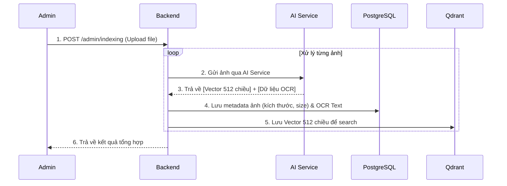
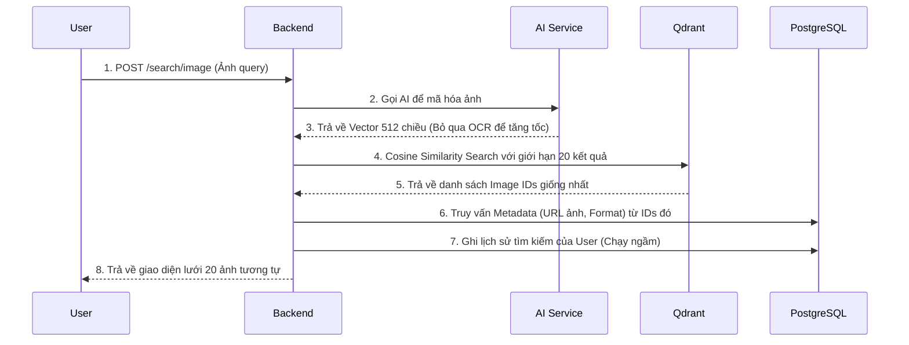

# 📘 Visual Search Engine — System Documentation

Tài liệu này cung cấp hướng dẫn khởi chạy dự án, danh sách các API đang hoạt động và mô tả chi tiết các luồng nghiệp vụ chính trong hệ thống Visual Search Engine.

---

## 1. Hướng dẫn khởi chạy dự án

Để đảm bảo hệ thống chạy trơn tru và có sẵn dữ liệu mẫu (tránh các lỗi xung đột database từ những lần chạy trước), vui lòng làm đúng theo các bước sau:

**Bước 1: Dọn dẹp môi trường cũ (Rất quan trọng)**
Lệnh này sẽ xóa sạch các container và volume dữ liệu cũ (PostgreSQL, Qdrant) để khởi tạo lại từ đầu một cách an toàn:

```bash
docker compose down -v
```

**Bước 2: Build và khởi động các services**

```bash
docker compose up -d --build
```

*Hệ thống sẽ khởi chạy 4 container: Backend (Port 8000), AI Service (Port 9000), Database PostgreSQL (Port 5432) và Vector DB Qdrant (Port 6333).*

**Bước 3: Nạp dữ liệu mẫu (Migration)**
Chúng tôi đã chuẩn bị sẵn bộ dữ liệu đã được AI xử lý (PostgreSQL JSON + Qdrant vectors) trong thư mục `datasets/exported-data`. Để nạp dữ liệu này vào hệ thống mới chạy:

```bash
docker exec -it backend npx tsx src/scripts/import-data.ts --clear
```

*(Cờ `--clear` sẽ tự động xóa sạch rác trong DB nếu có và nạp dữ liệu từ đầu. Lệnh chạy cực nhanh trong vài giây).*

---

## 2. Danh sách API (API Reference)

Dưới đây là danh sách ~9 API chính đang hoạt động trong hệ thống. *(Chưa bao gồm các API kiểm tra sức khỏe hệ thống `/health` và tài liệu Swagger `/api-docs`)*.

Chi tiết body request và response, bạn có thể xem trực tiếp giao diện Swagger UI tại: `http://localhost:8000/api-docs`

### 2.1 — Nhóm Auth (Xác thực)

| Method | Endpoint | Yêu cầu JWT | Mô tả |
|--------|----------|-------------|-------|
| `POST` | `/auth/register` | ❌ | Đăng ký tài khoản người dùng mới. |
| `POST` | `/auth/login` | ❌ | Đăng nhập và nhận Access Token (JWT). |

### 2.2 — Nhóm Client (Tìm kiếm)

| Method | Endpoint | Yêu cầu JWT | Mô tả |
|--------|----------|-------------|-------|
| `POST` | `/search/image` | ✅ | Tìm kiếm ảnh tương tự. Nhận 1 file ảnh, gửi qua AI lấy vector và truy vấn Qdrant để tìm 20 ảnh giống nhất. |

### 2.3 — Nhóm Admin (Quản lý Ảnh & User)

*Tất cả API nhóm này đều yêu cầu JWT của tài khoản có Role là `ADMIN`.*

| Method | Endpoint | Yêu cầu JWT | Mô tả |
|--------|----------|-------------|-------|
| `POST` | `/admin/indexing` | ✅ (Admin) | Upload hàng loạt ảnh (tối đa 20 file). Tự động gọi AI xử lý OCR + Embedding và lưu vào kho dữ liệu. |
| `GET` | `/admin/images` | ✅ (Admin) | Lấy danh sách ảnh đã index (hỗ trợ phân trang, lọc theo format, ngày tháng). |
| `GET` | `/admin/images/:id` | ✅ (Admin) | Lấy chi tiết 1 bức ảnh (bao gồm kích thước gốc và toàn bộ text OCR đã nhận diện). |
| `DELETE` | `/admin/images/:id` | ✅ (Admin) | Xóa 1 ảnh khỏi hệ thống. Tự động xóa sạch dữ liệu liên kết trong PostgreSQL, Qdrant và file vật lý. |
| `GET` | `/admin/users` | ✅ (Admin) | Quản lý danh sách người dùng, xem tổng số lượt tìm kiếm của từng người. |
| `GET` | `/admin/users/:userId/search-history` | ✅ (Admin) | Theo dõi lịch sử tìm kiếm của 1 user cụ thể (họ đã tìm gì, lúc nào). |

---

## 3. Mô tả Luồng nghiệp vụ (Business Flow)

### Luồng 1: Admin Indexing Ảnh (Thêm dữ liệu mới)

Đây là trái tim của hệ thống lưu trữ, chịu trách nhiệm xử lý ảnh đầu vào thành các ma trận toán học.



**Chi tiết:**

- Backend sẽ tạo ra URL `imageUrl` cho bức ảnh thay vì dùng đường dẫn vật lý cục bộ để Frontend dễ dàng hiển thị.
- Tính nhất quán dữ liệu (Consistency) được đảm bảo bằng `Prisma Transaction`: Nếu quá trình lưu PostgreSQL thất bại, việc lưu Qdrant sẽ bị hủy.

### Luồng 2: Khách hàng tìm kiếm bằng ảnh (Visual Search)

Đây là luồng truy vấn tốc độ cao sử dụng công nghệ tìm kiếm láng giềng gần nhất (KNN - K-Nearest Neighbors).



**Chi tiết:**

- **Tối ưu tốc độ:** AI Service có 2 hàm riêng biệt. Khi tìm kiếm, BE chỉ yêu cầu AI chạy model CLIP để lấy Vector, hoàn toàn bỏ qua EasyOCR vì không cần thiết.
- **Tính toán điểm số:** Qdrant sử dụng chuẩn **Cosine** để so sánh Vector của ảnh Query với hàng vạn vector trong kho, trả về điểm tin cậy `similarityScore` từ 0.0 đến 1.0.

### Luồng 3: Quản lý và Xóa dữ liệu (Cascade Deletion)

Khi Admin muốn xóa một bức ảnh rác hoặc lỗi ra khỏi hệ thống:

1. Admin gọi lệnh `DELETE /admin/images/:id`.
2. PostgreSQL xóa bản ghi gốc. Các bảng con như `image_index` và `image_ocr` được **tự động xóa** nhờ khóa ngoại `ON DELETE CASCADE`.
3. Backend phát tín hiệu sang Qdrant để xóa vector tương ứng.
4. (Tuỳ chọn) Backend xóa file ảnh vật lý nằm trong thư mục `/storage`.
Luồng này đảm bảo không bao giờ để lại "dữ liệu mồ côi" trong hệ thống tìm kiếm đa cơ sở dữ liệu.
