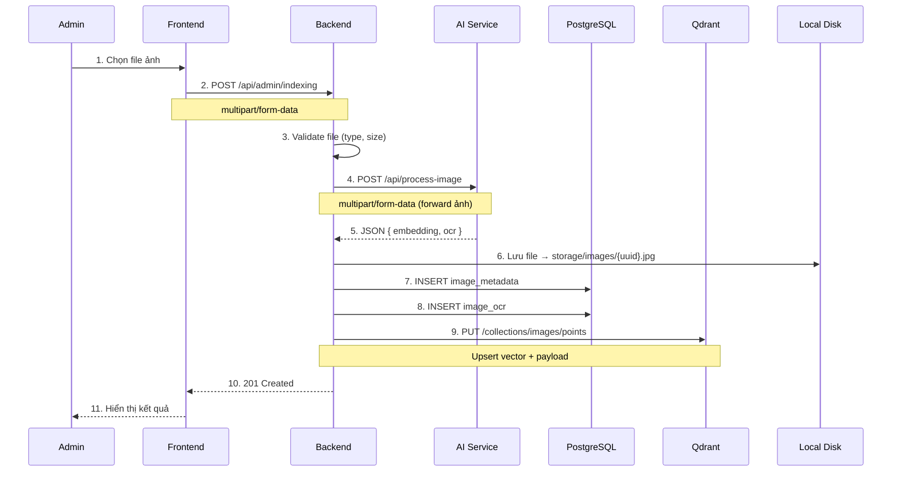
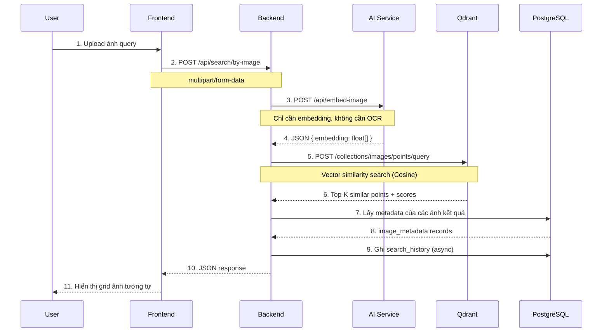
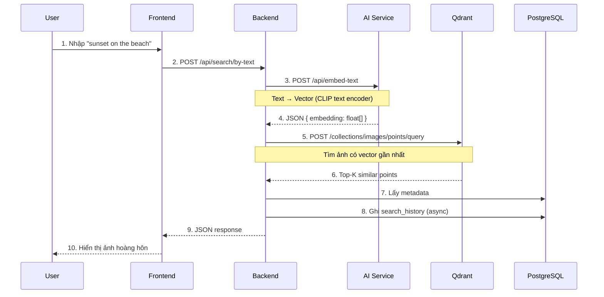
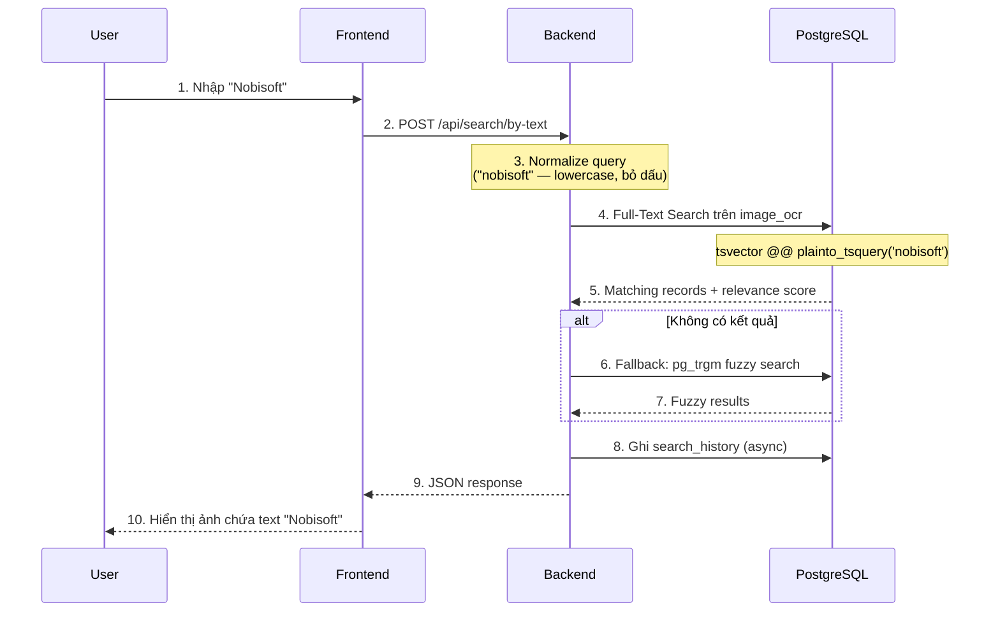
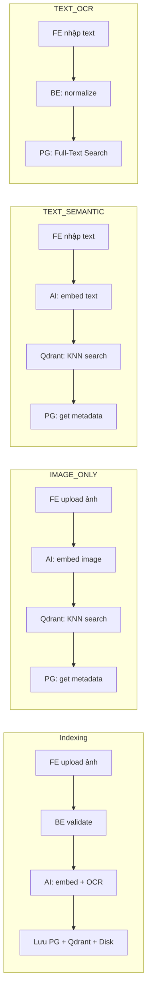

# 📘 Visual Search Engine — API & Flow Documentation

> Tài liệu mô tả chi tiết 4 luồng use case chính, bao gồm API contract (JSON) giữa Frontend ↔ Backend ↔ AI Service ↔ Qdrant.

---

## Tổng quan kiến trúc

```
┌──────────┐     HTTP/REST     ┌──────────┐     HTTP/REST     ┌────────────┐
│ Frontend │ ◄──────────────► │ Backend  │ ◄──────────────► │ AI Service │
│ (React)  │                   │ (Node.js)│                   │ (FastAPI)  │
└──────────┘                   └────┬─────┘                   └────────────┘
                                    │
                        ┌───────────┼───────────┐
                        ▼           ▼           ▼
                   ┌─────────┐ ┌────────┐ ┌──────────┐
                   │PostgreSQL│ │ Qdrant │ │Local Disk│
                   │(metadata,│ │(vectors)│ │ (images) │
                   │OCR, etc) │ └────────┘ └──────────┘
                   └─────────┘
```

### Service URLs (Docker)

| Service | Internal URL | External URL |
|---------|-------------|--------------|
| Backend | `http://backend:8000` | `http://localhost:8000` |
| AI Service | `http://ai-service:9000` | `http://localhost:9000` |
| Qdrant | `http://qdrant:6333` | `http://localhost:6333` |
| PostgreSQL | `database:5432` | `localhost:5432` |

---

## Use Case 1: Admin Indexing (Upload & Index ảnh)

### Sequence Diagram



### API: Frontend → Backend

```
POST /api/admin/indexing
Authorization: Bearer <admin_jwt_token>
Content-Type: multipart/form-data
```

**Request (form-data):**

```
┌─────────────────────────────────────────────┐
│ Field    │ Type   │ Required │ Description  │
├──────────┼────────┼──────────┼──────────────┤
│ image    │ File   │ ✅       │ File ảnh     │
│          │        │          │ (jpg/png/webp│
│          │        │          │ max 10MB)    │
└─────────────────────────────────────────────┘
```

**Response — 201 Created:**

```json
{
  "success": true,
  "message": "Indexing thành công",
  "data": {
    "id": "550e8400-e29b-41d4-a716-446655440000",
    "path": "storage/images/550e8400.jpg",
    "width": 1920,
    "height": 1080,
    "fileSize": 245760,
    "fileFormat": "jpg",
    "indexedAt": "2026-07-10T08:30:00.000Z",
    "ocrLines": [
      {
        "rawText": "NOBISOFT TECHNOLOGY CO., LTD",
        "confidenceScore": 0.98
      },
      {
        "rawText": "123 Nguyen Hue, District 1, HCMC",
        "confidenceScore": 0.93
      }
    ]
  }
}
```

**Response — 400 Bad Request:**

```json
{
  "success": false,
  "message": "File không hợp lệ. Chỉ chấp nhận jpg, png, webp (tối đa 10MB)"
}
```

### API: Backend → AI Service

```
POST http://ai-service:9000/api/process-image
Content-Type: multipart/form-data
```

**Request (form-data):**

```
┌─────────────────────────────────────────────┐
│ Field    │ Type   │ Required │ Description  │
├──────────┼────────┼──────────┼──────────────┤
│ image    │ File   │ ✅       │ Binary ảnh   │
└─────────────────────────────────────────────┘
```

**Response — 200 OK (AI trả về):**

```json
{
  "success": true,
  "data": {
    "embedding": [0.0123, -0.0456, 0.0789, "... (512 or 768 floats)"],
    "ocrLines": [
      {
        "rawText": "NOBISOFT TECHNOLOGY CO., LTD",
        "confidenceScore": 0.98,
        "boundingBox": { "x": 100, "y": 50, "width": 520, "height": 30 }
      },
      {
        "rawText": "123 Nguyen Hue, District 1, HCMC",
        "confidenceScore": 0.93,
        "boundingBox": { "x": 100, "y": 90, "width": 480, "height": 28 }
      }
    ]
  }
}
```

> [!NOTE]
>
> - `embedding`: Mảng float được tạo bởi model CLIP/ResNet — kích thước cố định (512 hoặc 768 tùy model, cần thống nhất với AI team).
> - `ocrLines`: Mỗi phần tử tương ứng với **1 dòng text** trên ảnh (không phải 1 từ). Mỗi dòng có `boundingBox` riêng để highlight.
> - 1 dòng OCR → 1 record `image_ocr` trong PostgreSQL.
> - Nếu ảnh không có text, `ocrLines` sẽ là mảng rỗng `[]`.

### API: Backend → Qdrant (Upsert Vector)

```
PUT http://qdrant:6333/collections/images/points
Content-Type: application/json
```

**Request:**

```json
{
  "points": [
    {
      "id": "550e8400-e29b-41d4-a716-446655440000",
      "vector": [0.0123, -0.0456, 0.0789, "... (512 floats)"],
      "payload": {
        "imageId": "550e8400-e29b-41d4-a716-446655440000",
        "path": "storage/images/550e8400.jpg",
        "fileFormat": "jpg",
        "hasOcr": true
      }
    }
  ]
}
```

**Response — 200 OK:**

```json
{
  "result": {
    "operation_id": 42,
    "status": "completed"
  },
  "status": "ok",
  "time": 0.003
}
```

### Dữ liệu lưu trữ

| Nơi lưu | Dữ liệu | Mục đích |
|---------|---------|---------|
| **PostgreSQL** `image_metadata` | id, path, width, height, fileSize, fileFormat, indexedAt | Tra cứu metadata |
| **PostgreSQL** `image_ocr` | rawText, normalizedText, confidence, boundingBoxes (mỗi record = 1 dòng) | Phục vụ TEXT_OCR search |
| **Qdrant** `images` collection | vector + payload (imageId, path) | Phục vụ IMAGE_ONLY & TEXT_SEMANTIC search |
| **Local Disk** `storage/images/` | File ảnh gốc | Phục vụ hiển thị ảnh cho user |

---

## Use Case 2: Search by Image (IMAGE_ONLY)

### Sequence Diagram



### API: Frontend → Backend

```
POST /api/v1/search/by-image
Content-Type: multipart/form-data
```

**Request (form-data):**

```
┌─────────────────────────────────────────────────────┐
│ Field    │ Type    │ Required │ Description          │
├──────────┼─────────┼──────────┼──────────────────────┤
│ image    │ File    │ ✅       │ Ảnh query            │
│ limit    │ Integer │ ❌       │ Số kết quả (mặc định 20) │
│ page     │ Integer │ ❌       │ Trang (mặc định 1)   │
└─────────────────────────────────────────────────────┘
```

**Response — 200 OK:**

```json
{
  "success": true,
  "data": {
    "searchType": "IMAGE_ONLY",
    "results": [
      {
        "id": "img-uuid-001",
        "path": "storage/images/img-001.jpg",
        "width": 1920,
        "height": 1080,
        "fileFormat": "jpg",
        "similarityScore": 0.97,
        "createdAt": "2026-07-09T10:00:00.000Z"
      },
      {
        "id": "img-uuid-002",
        "path": "storage/images/img-002.png",
        "width": 800,
        "height": 600,
        "fileFormat": "png",
        "similarityScore": 0.91,
        "createdAt": "2026-07-08T14:30:00.000Z"
      }
    ],
    "total": 2,
    "page": 1,
    "limit": 20
  }
}
```

### API: Backend → AI Service (Embed Image)

```
POST http://ai-service:9000/api/embed-image
Content-Type: multipart/form-data
```

**Request:** File ảnh (binary)

**Response — 200 OK:**

```json
{
  "success": true,
  "data": {
    "embedding": [0.0123, -0.0456, 0.0789, "... (512 floats)"]
  }
}
```

> [!TIP]
> Endpoint này **chỉ trả embedding**, không chạy OCR — nhanh hơn `/process-image`. Dùng cho search, không phải indexing.

### API: Backend → Qdrant (Vector Search)

```
POST http://qdrant:6333/collections/images/points/query
Content-Type: application/json
```

**Request:**

```json
{
  "query": [0.0123, -0.0456, 0.0789, "... (512 floats)"],
  "limit": 20,
  "with_payload": true
}
```

**Response — 200 OK:**

```json
{
  "result": {
    "points": [
      {
        "id": "img-uuid-001",
        "version": 1,
        "score": 0.97,
        "payload": {
          "imageId": "img-uuid-001",
          "path": "storage/images/img-001.jpg",
          "fileFormat": "jpg"
        }
      },
      {
        "id": "img-uuid-002",
        "version": 1,
        "score": 0.91,
        "payload": {
          "imageId": "img-uuid-002",
          "path": "storage/images/img-002.png",
          "fileFormat": "png"
        }
      }
    ]
  },
  "status": "ok",
  "time": 0.012
}
```

---

## Use Case 3: Search by Text Semantic (TEXT_SEMANTIC)

### Sequence Diagram



### Điểm khác biệt so với IMAGE_ONLY

| Tiêu chí | IMAGE_ONLY | TEXT_SEMANTIC |
|----------|-----------|--------------|
| Input từ user | File ảnh | Chuỗi text |
| AI endpoint | `/embed-image` | `/embed-text` |
| AI model | CLIP image encoder | CLIP **text** encoder |
| Qdrant query | Giống nhau | Giống nhau |

> [!IMPORTANT]
> CLIP model có 2 encoder cùng output ra **cùng không gian vector** — nên vector từ text và vector từ image có thể so sánh trực tiếp bằng cosine similarity. Đây là cốt lõi của cross-modal search.

### API: Frontend → Backend

```
POST /api/v1/search/by-text
Content-Type: application/json
```

**Request:**

```json
{
  "query": "sunset on the beach",
  "searchType": "TEXT_SEMANTIC",
  "limit": 20,
  "page": 1
}
```

**Response — 200 OK:**

```json
{
  "success": true,
  "data": {
    "searchType": "TEXT_SEMANTIC",
    "results": [
      {
        "id": "img-uuid-099",
        "path": "storage/images/img-099.jpg",
        "width": 3840,
        "height": 2160,
        "fileFormat": "jpg",
        "similarityScore": 0.89,
        "createdAt": "2026-07-05T16:00:00.000Z"
      }
    ],
    "total": 1,
    "page": 1,
    "limit": 20
  }
}
```

### API: Backend → AI Service (Embed Text)

```
POST http://ai-service:9000/api/embed-text
Content-Type: application/json
```

**Request:**

```json
{
  "text": "sunset on the beach"
}
```

**Response — 200 OK:**

```json
{
  "success": true,
  "data": {
    "embedding": [0.0234, -0.0567, 0.0890, "... (512 floats)"]
  }
}
```

> [!NOTE]
> Vector trả về cùng dimension (512) với image embedding — vì cả 2 dùng chung CLIP model. Điều này cho phép so sánh cross-modal trong Qdrant.

### Qdrant Query: Giống hệt IMAGE_ONLY

Backend gửi vector (dù từ text hay image) đến Qdrant theo cùng API — Qdrant không quan tâm nguồn gốc vector.

---

## Use Case 4: Search by Text OCR (TEXT_OCR)

### Sequence Diagram



### Điểm khác biệt: KHÔNG gọi AI, KHÔNG dùng Qdrant

| Tiêu chí | TEXT_SEMANTIC | TEXT_OCR |
|----------|-------------|---------|
| Gọi AI? | ✅ Cần embed text | ❌ Không cần |
| Dùng Qdrant? | ✅ Vector search | ❌ Không cần |
| Dùng PostgreSQL? | Chỉ lấy metadata | ✅ **Full-text search trên OCR data** |
| Tìm gì? | Ý nghĩa / ngữ nghĩa | Chuỗi ký tự chính xác |
| Ví dụ | "ảnh hoàng hôn" → ảnh sunset | "ABC-1234" → ảnh biển số xe |

### API: Frontend → Backend

```
POST /api/search/by-text
Content-Type: application/json
```

**Request:**

```json
{
  "query": "Nobisoft",
  "searchType": "TEXT_OCR",
  "limit": 20,
  "page": 1
}
```

> [!NOTE]
> Dùng **cùng endpoint** `/search/by-text` với `TEXT_SEMANTIC` — Backend phân biệt qua field `searchType` để chọn luồng xử lý phù hợp.

**Response — 200 OK:**

```json
{
  "success": true,
  "data": {
    "searchType": "TEXT_OCR",
    "results": [
      {
        "id": "img-uuid-042",
        "path": "storage/images/img-042.jpg",
        "width": 1280,
        "height": 720,
        "fileFormat": "jpg",
        "relevanceScore": 0.95,
        "ocrPreview": "NOBISOFT TECHNOLOGY CO., LTD — 123 Nguyen Hue...",
        "ocrHighlight": {
          "matchedText": "NOBISOFT",
          "boundingBox": { "x": 100, "y": 50, "width": 200, "height": 30 }
        },
        "createdAt": "2026-07-09T10:00:00.000Z"
      }
    ],
    "total": 1,
    "page": 1,
    "limit": 20
  }
}
```

### Backend xử lý nội bộ (Không gọi service ngoài)

```
Input: "Nobisoft"
  │
  ├── 1. Normalize → "nobisoft"
  │
  ├── 2. PostgreSQL Full-Text Search (mỗi record = 1 dòng OCR)
  │       SELECT im.*, ocr.raw_text, ts_rank(...)
  │       FROM image_ocr ocr
  │       JOIN image_metadata im ON ocr.image_id = im.id
  │       WHERE ocr.normalized_text_tsv @@ plainto_tsquery('simple', 'nobisoft')
  │       ORDER BY ts_rank DESC
  │
  ├── 3. Nếu 0 kết quả → Fallback pg_trgm
  │       WHERE ocr.normalized_text % 'nobisoft'
  │         OR ocr.normalized_text ILIKE '%nobisoft%'
  │
  └── 4. Return results (group by image)
```

---

## Tổng hợp: API Endpoints Map

### Public APIs (Frontend → Backend)

| Method | Endpoint | Auth | Use Case | Input |
|--------|----------|------|----------|-------|
| `POST` | `/api/admin/indexing` | Admin JWT | Indexing | `multipart/form-data` (image file) |
| `POST` | `/api/search/by-image` | Optional JWT | IMAGE_ONLY | `multipart/form-data` (image file) |
| `POST` | `/api/search/by-text` | Optional JWT | TEXT_SEMANTIC / TEXT_OCR | `application/json` |

### Internal APIs (Backend → AI Service)

| Method | Endpoint | Khi nào dùng | Input | Output |
|--------|----------|-------------|-------|--------|
| `POST` | `/api/process-image` | Indexing | Image file | embedding + OCR + metadata |
| `POST` | `/api/embed-image` | Search by Image | Image file | embedding only |
| `POST` | `/api/embed-text` | Search by Text Semantic | JSON text | embedding only |

### Internal APIs (Backend → Qdrant)

| Method | Endpoint | Khi nào dùng | Input |
|--------|----------|-------------|-------|
| `PUT` | `/collections/images/points` | Indexing | vector + payload |
| `POST` | `/collections/images/points/query` | IMAGE_ONLY, TEXT_SEMANTIC | query vector + limit |
| `DELETE` | `/collections/images/points/delete` | Xóa ảnh | point IDs |

---

## So sánh 4 luồng



| | Indexing | IMAGE_ONLY | TEXT_SEMANTIC | TEXT_OCR |
|---|:---:|:---:|:---:|:---:|
| Gọi AI Service | ✅ | ✅ | ✅ | ❌ |
| Dùng Qdrant | ✅ Write | ✅ Read | ✅ Read | ❌ |
| Dùng PostgreSQL | ✅ Write | ✅ Read meta | ✅ Read meta | ✅ **Full-text search** |
| Lưu Local Disk | ✅ | ❌ | ❌ | ❌ |
| Auth required | Admin | Optional | Optional | Optional |
| Input type | File | File | JSON text | JSON text |
